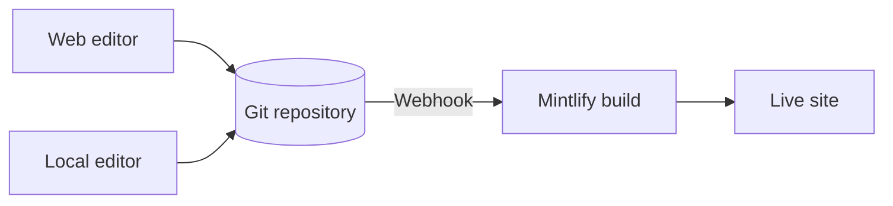
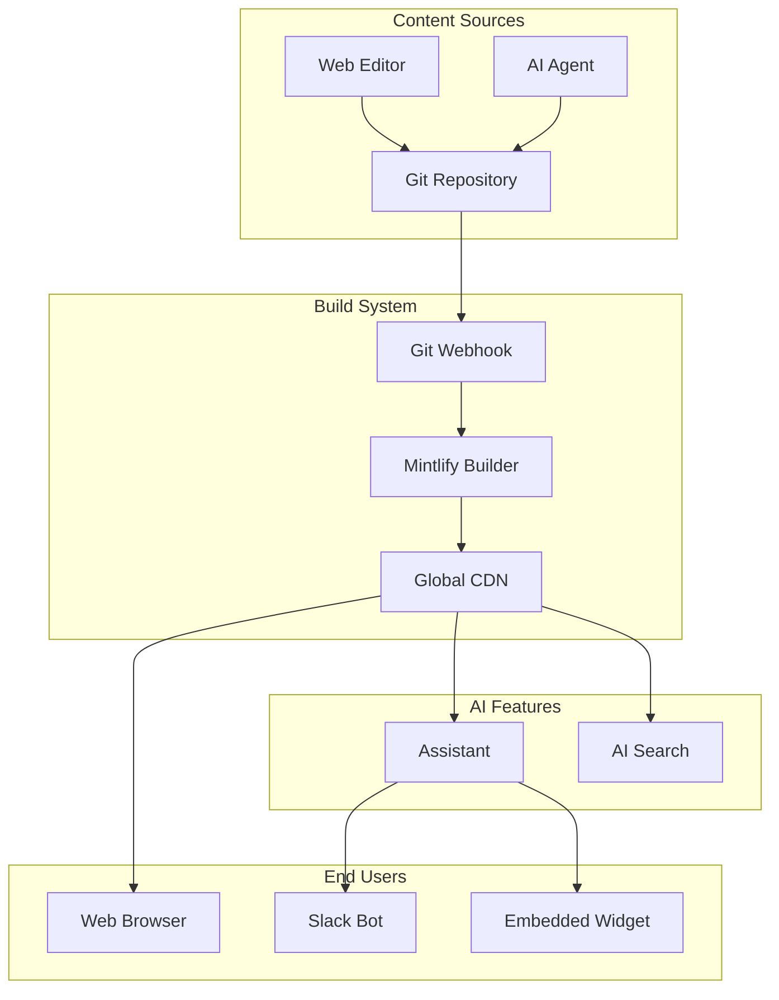

Mintlify hosts your content as a website. Your content lives in a Git repository as MDX files, and Mintlify builds and deploys your site automatically when you push a change.

## The three parts of a Mintlify project

**Your repository** is the source of truth for your documentation. It contains an MDX file for every page and a `docs.json` file that configures your site's navigation, theme, and settings. You can use your own GitHub or GitLab repository, or let Mintlify create one for you during onboarding.

**The Mintlify dashboard** connects to your repository and lets you manage your site. Use it to monitor deployments, configure settings, manage your team, and edit content directly in the browser.

**Your site** powered by Mintlify. Mintlify builds your site from your repository and deploys it at a `.mintlify.app` URL by default. When you're ready, you can point a custom domain to your site.



## How Mintlify works

Mintlify provides the infrastructure for documentation sites that help people and AI find and understand information.

### Content lives in Git

Your documentation is stored as MDX files in a Git repository. This gives you version control, collaboration workflows, and the ability to keep documentation close to your code. The `docs.json` configuration file defines your site's navigation, theme, and settings.

```text Project structure
your-project/
├── docs.json          # Site configuration
├── introduction.mdx   # Pages as MDX files
├── quickstart.mdx
├── guides/
│   ├── api-keys.mdx
│   └── webhooks.mdx
└── api-reference/
    └── openapi.yaml   # Optional API spec
```

### Builds are automatic

When you push changes to your repository, Mintlify automatically builds and deploys your site. You can preview changes in pull requests before merging to production.

### AI features are built-in

Mintlify includes AI features that help users find answers and help you maintain content:

- **Assistant**: Lets your users ask questions and get cited answers from your content
- **Agent**: Helps your team create and maintain content through automated workflows, pull request reviews, or Slack conversations

See [AI-native documentation](/ai-native) for an overview of all AI features.

## Editing content

There are two ways to edit your content, and you can switch between them freely.

- **Web editor**: Edit and publish pages in your browser. The editor commits changes back to your Git repository automatically.
- **CLI and local editor**: Clone your repository, run `mint dev` to preview your site locally, then push changes to deploy.

Multiple team members can work in either workflow at the same time, using Git branches to manage parallel changes. Anyone who can push to your repository can update your content.

## Platform architecture

Mintlify's architecture separates content from presentation, giving you flexibility while maintaining performance and reliability.



### Content layer

Your MDX files and configuration live in Git. This provides version control, enables collaboration through pull requests, and keeps documentation synchronized with code changes.

### Build layer

When you push changes, Mintlify's build system generates your site and deploys it to a global CDN. Preview deployments let you review changes before they go live.

### AI layer

The assistant and search features index your content and use AI to help users find answers. These features work automatically without additional configuration.

### Delivery layer

Your site is delivered through a global CDN for fast page loads worldwide. You can use the default `.mintlify.app` domain or connect a custom domain.

## Use cases

Mintlify supports multiple documentation use cases with different requirements:

### Developer documentation

Help developers integrate with your APIs, SDKs, and tools.

- Generate interactive API references from OpenAPI specifications
- Include code examples with syntax highlighting and explanations
- Provide versioning for multiple API versions
- Connect to GitHub or GitLab for synchronized updates

See [Create developer documentation](/guides/developer-documentation) for implementation details.

### Knowledge bases

Consolidate internal information for your team.

- Control access with SSO or OAuth authentication
- Use group-based permissions for sensitive content
- Enable team contributions through the web editor
- Capture knowledge from Slack conversations with the agent

See [Create a knowledge base](/guides/knowledge-base) for implementation details.

### Support centers

Build self-service support that reduces ticket volume.

- Help customers find answers with AI-powered search
- Reduce repetitive support requests
- Track which articles help users the most
- Integrate with your existing support tools

See [Create a support center](/guides/support-center) for implementation details.

### Custom frontends

Render documentation with your own design and components.

- Use the Mintlify Astro integration for full control
- Keep Mintlify's build system and AI features
- Customize every aspect of the presentation layer
- Integrate documentation into your existing site

See [Create a custom frontend](/guides/custom-frontend) for implementation details.

## Key features

### Built for collaboration

- **Multiple editors**: Web editor, local CLI, or AI agent
- **Git workflows**: Branches, pull requests, and reviews
- **Team management**: Control access and permissions
- **Preview deployments**: Review changes before publishing

### Optimized for developers

- **OpenAPI integration**: Generate API references automatically
- **Code blocks**: Syntax highlighting and explanations
- **Versioning**: Maintain docs for multiple product versions
- **GitHub/GitLab sync**: Keep docs close to code

### AI-powered

- **Assistant**: Answers questions with cited sources
- **Agent**: Generates and updates content
- **Smart search**: Finds relevant content semantically
- **Slack integration**: Answer questions where your team works

### Production-ready

- **Global CDN**: Fast page loads worldwide
- **Custom domains**: Use your own domain
- **Authentication**: SSO, OAuth, and group-based access
- **Analytics**: Track usage and improve content

## Next steps

<Card title="Quickstart" icon="rocket" horizontal href="/quickstart">
  Deploy your first documentation site in minutes.
</Card>
